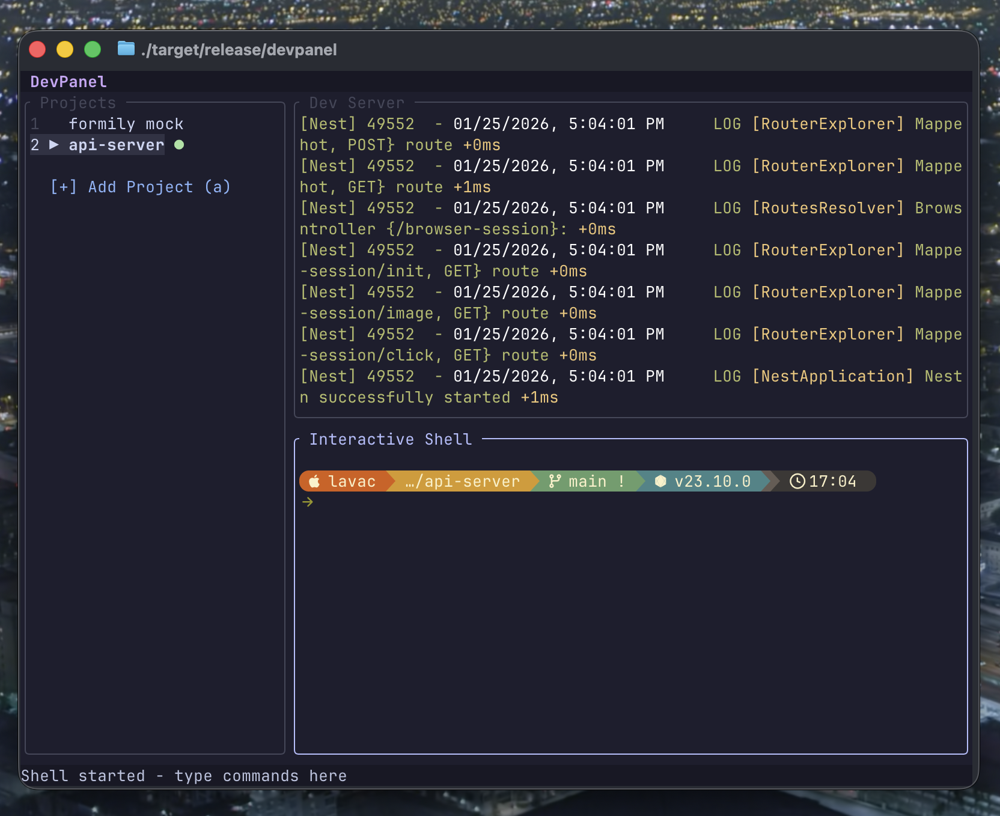

# DevPanel

[](https://github.com/lavac/devpanel/actions/workflows/ci.yml)
[](https://github.com/lavac/devpanel/actions/workflows/release.yml)
[](https://opensource.org/licenses/MIT)

[中文文档](README_CN.md)

A TUI tool for managing multiple frontend projects in a single terminal window, with split views for Dev Server logs and Interactive Shell.



## Features

- **Multi-project Management**: Manage multiple frontend projects in one terminal window
- **Split View**: Dev Server output on top, Interactive Shell on bottom
- **Command Palette**: Quick access to npm scripts and custom commands
- **Auto Detection**: Automatically parse `package.json` for available scripts
- **Package Manager Detection**: Auto-detect npm/yarn/pnpm/bun
- **Process Freeze**: Suspend/resume Dev Server to save system resources
- **Project Aliases**: Set custom display names for projects
- **Persistent Config**: Auto-save project list and custom commands
- **Cross-platform**: Supports macOS, Linux, and Windows
- **Beautiful UI**: Catppuccin Mocha theme with rounded borders
- **Full Terminal Support**: ANSI colors, Starship prompt, and more
- **Mouse Support**: Click to switch focus and select projects
- **i18n**: English and Chinese interface

## Installation

### Download from Releases (Recommended)

Download the binary for your platform from [Releases](https://github.com/lavac/devpanel/releases):

| Platform | Architecture | File |
|----------|--------------|------|
| macOS | Intel | `devpanel-macos-x86_64` |
| macOS | Apple Silicon | `devpanel-macos-aarch64` |
| Linux | x86_64 | `devpanel-linux-x86_64` |
| Linux | ARM64 | `devpanel-linux-aarch64` |
| Windows | x86_64 | `devpanel-windows-x86_64.exe` |

```bash
# macOS / Linux
chmod +x devpanel-*
./devpanel-*

# Or install to system
sudo mv devpanel-* /usr/local/bin/devpanel
```

### Build from Source

```bash
# Clone repository
git clone https://github.com/lavac/devpanel.git
cd devpanel

# Build
cargo build --release

# Run
./target/release/devpanel
```

## Usage

### Keyboard Shortcuts

**Project Navigation (Sidebar)**
| Key | Action |
|-----|--------|
| `1-9` | Quick switch to project |
| `Tab` / `Shift+Tab` | Switch projects |
| `j` / `k` / `↑` / `↓` | Navigate projects |
| `Enter` | Enter Interactive Shell |
| `r` | Open command palette |
| `a` | Add new project |
| `e` | Edit project alias |
| `c` | Add custom command |
| `d` | Delete project |
| `,` | Open settings |
| `q` / `Ctrl+C` | Quit |
| `?` | Show help |

**Dev Terminal (Output Only)**
| Key | Action |
|-----|--------|
| `x` | Send interrupt signal |
| `p` | Pause/Resume process (freeze) |
| `r` | Run new command (replaces current) |
| `s` | Stop Dev Server |
| Mouse click | Focus and enable scroll |
| `j/k/↑/↓` | Scroll through log history |
| `Esc` | Return to sidebar |

**Interactive Shell (Full Interactive)**
| Key | Action |
|-----|--------|
| All keys | Sent directly to shell |
| `Esc` | Return to sidebar (keeps shell running) |

### Mouse Operations

| Action | Effect |
|--------|--------|
| Click sidebar | Select project |
| Click Dev area | Focus Dev Terminal (scrollable) |
| Click Shell area | Enter Interactive Shell |
| Scroll wheel | Scroll content based on focus |

### Adding a Project

1. Press `a` to enter add project mode
2. Enter the full path to the project (must contain `package.json`)
3. Press `Enter` to confirm

### Running Commands

1. Select a project
2. Press `r` to open command palette
3. Use `j`/`k` to select a command
4. Press `Enter` to execute

### Adding Custom Commands

1. Select a project
2. Press `c` to enter add command mode
3. Enter format: `name:command`
   - Example: `docker:docker-compose up -d`
4. Press `Enter` to confirm

### Pause/Resume Process

Press `p` to pause (freeze) a running Dev Server process, saving CPU and memory.
- Paused status shows `⏸` icon in sidebar
- Press `p` again to resume
- Only supported on macOS/Linux

## Configuration

Config file `devpanel.json` is saved in the current working directory:

```json
{
  "projects": [
    {
      "path": "/path/to/your/project",
      "alias": "My App",
      "custom_commands": [
        {
          "id": "uuid",
          "name": "Start Docker",
          "command": "docker-compose up -d",
          "type": "RawShell"
        }
      ]
    }
  ],
  "settings": {
    "theme": "catppuccin-mocha",
    "default_runner": "pnpm",
    "language": "English"
  }
}
```

## Command Types

- **NpmScript**: Executed via package manager (e.g., `pnpm dev`)
- **RawShell**: Executed directly in shell (e.g., `docker-compose up`)

## Architecture

```
devpanel/
├── src/
│   ├── main.rs           # Entry point, async main loop
│   ├── app.rs            # AppState global state management
│   ├── event.rs          # Event handling and shortcuts
│   ├── i18n.rs           # Internationalization
│   ├── ui/               # UI components
│   │   ├── layout.rs     # Main layout
│   │   ├── sidebar.rs    # Project list
│   │   ├── terminal.rs   # Terminal panel
│   │   ├── settings_popup.rs
│   │   ├── command_palette.rs
│   │   └── theme.rs      # Catppuccin theme
│   ├── pty/              # PTY management
│   │   ├── manager.rs    # PTY lifecycle
│   │   └── bridge.rs     # PTY-UI bridge
│   ├── project/          # Project management
│   │   ├── package.rs    # package.json parsing
│   │   └── scanner.rs    # Project scanning
│   ├── config/           # Configuration persistence
│   └── platform/         # Cross-platform utilities
└── Cargo.toml
```

## Tech Stack

- **UI**: [Ratatui](https://ratatui.rs/) + [Crossterm](https://github.com/crossterm-rs/crossterm)
- **Async**: [Tokio](https://tokio.rs/)
- **PTY**: [portable-pty](https://github.com/wez/wezterm/tree/main/pty) + [tui-term](https://github.com/a-kenji/tui-term)
- **Terminal Parsing**: [vt100](https://github.com/doy/vt100-rust)

## License

MIT
